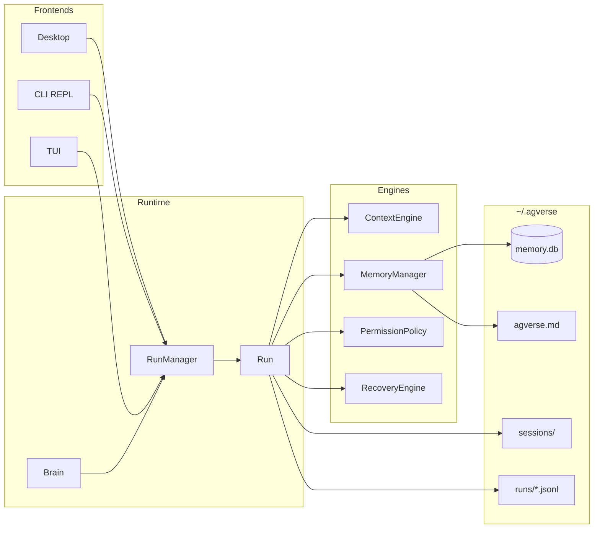

# Agverse

**Agverse** is a Rust-native AI coding agent with three frontends over one runtime:

| Surface | How you use it |
| -------- | ---------------- |
| **Desktop (GUI)** | Tauri + React app — `Agverse` |
| **CLI (REPL)** | Interactive terminal chat — binary `ageverse` |
| **TUI** | Full-screen terminal UI — `ageverse --tui` |

This repository is named **`agent_core`**. The shared library crate is also `agent_core`; the CLI package is `agent-cli` and installs as the **`ageverse`** binary.

---

## Features at a glance

| Area | What you get |
| ---- | ------------ |
| **ReAct agent loop** | Think → tool call → observe, with streaming |
| **8-segment context** | Stable prefix + per-turn injection; dual-track transcript |
| **KV-cache–aware prompts** | Frozen system prompt; Anthropic `cache_control`; hit/miss telemetry |
| **Layered memory** | Core / Recall / Archival + Ebbinghaus salience + `agverse.md` |
| **Permission policy** | Sandbox → modes → rules; five-tier human approvals |
| **Run runtime** | Brain → RunManager → Run; steer / follow-up; DAG tool scheduling |
| **Durable state** | `~/.agverse` sessions, SQLite memory, append-only run logs |
| **Recovery** | Compact / retry / circuit-break / escalate tokens / abort |
| **MCP & skills** | Auto-discovered tools; skill packs with activation |
| **Eval + Harbor** | Contract/golden suites; Harbor adapter for benchmarks |

---

## Design deep dive

Most agent CLIs glue a chat UI to an HTTP client. Agverse treats the **model window as an engineered artifact**: what the LLM sees is deliberately different from what you keep forever, what is safe to run, and what survives a crash.



### Context engineering — two tracks, eight segments

The model does **not** get a flat dump of history. `ContextEngine` assembles an **8-segment** system surface with explicit stability and refresh policies:

| Segment | Stability | Refresh | Lives in |
| ------- | --------- | ------- | -------- |
| `identity` | Stable | Never | **Frozen system** (cache prefix) |
| `principles` | Stable | On event | Frozen system |
| `tool_catalog` | Stable | On register | Frozen system |
| `environment` | Semi-stable | Per turn | Trailing injection |
| `active_memory` | Dynamic | Per turn | Trailing injection |
| `execution_plan` | Dynamic | Per turn | Trailing injection |
| `loaded_skills` | Dynamic | Per turn | Trailing injection |
| `skill_catalog` | Dynamic | Per turn | Trailing injection |

**Dual-track history**

- **Model window** — what goes to the provider: frozen system + conversation messages + trailing dynamic injection. Compaction and tool spill reshape *this* track under budget.
- **Full transcript** — UI / persistence path (`Run.full_transcript`). Compaction must not erase what you saw; the durable story stays intact while the model window stays lean.

**Under pressure** (≥ ~80% of the context budget): update a file ledger → merge into a bounded `[RollingSummary]` → prefer cache-friendly chunked drops of older turns → optional LLM delta merge. Huge incidental tool blobs are **spilled** to disk (`sessions/<id>/tool_spills/…`) and replaced in-window with a path + tail, so one `cat` of a 2MB file does not nuke the prefix.

Five compression stages (snip → dedup → chunk → summary → gradient) back `trim_to_fit` when a turn still will not fit.

#### Tool output hygiene & RollingSummary (complement)

Long agent sessions fail two ways: noisy tool dumps dominate the window, or compaction forgets what still matters. Agverse addresses both without inventing a second todo/progress track (live Segment 7 / execution state already owns that).

| Mechanism | Behavior |
| --------- | -------- |
| **Semantic truncation** | Instruction tools (`skill_load`) never cut; actively-read tools (`read_file`, …) keep a contiguous prefix under a high char cap; incidental noise (especially `shell`) is **tail-heavy** — errors and exit codes usually sit at the end. |
| **Dual incidental budget** | Truncate when output exceeds **2000 lines or 50KB**, whichever comes first. L2 request hygiene and L3 history snip share one policy so the model never sees a request view that disagrees with persisted history. |
| **Spill-to-file** | Oversized incidental results are written under `~/.agverse/sessions/<id>/tool_spills/` (global fallback if no session). The live UI still gets the full body via `ToolEnded`; the model window stores a truncated view plus a path so it can `read_file` the spill if needed. Resume does not re-inflate multi-MB logs. |
| **File ledger** | Successful `read_file` / `write_file` / `edit` update a deterministic session ledger (`read` / `wrote` / `deleted`, capped). Compaction injects these paths — the model does not have to “remember” them from raw tool text. |
| **RollingSummary** | A single leading `[RollingSummary]` in the model window holds bounded `goal` / `decisions` / `files` / `errors_open` / `facts` / `notes`. New compact deltas **merge** into the old summary (lists capped); chunked drop preserves that leading message so file/decision memory survives. |

Details and design notes: [`docs/active/PLAN-0016_context_efficiency_pi_learnings.md`](docs/active/PLAN-0016_context_efficiency_pi_learnings.md).

> **Design intent:** keep the *prefix* boring and stable; put *news* (cwd, memory hits, todos, skills) in the trailing injection so you pay for freshness without thrashing the KV cache.

### Cache hits — engineering for reuse, not luck

Provider KV / prompt caches reward **byte-stable prefixes**. Agverse leans into that:

1. **Frozen system prompt** = Stable segments only. Tool catalog stays frozen for the session when possible.
2. **Conversation bytes stay untouched** until an intentional compaction boundary.
3. **Per-turn dynamics** ride in a *trailing* system injection — they miss the cache *on purpose* so they do not invalidate the expensive prefix.
4. **Hints & telemetry** — Anthropic paths attach `cache_control: ephemeral` when reuse is expected; usage reports `prompt_cache_hit_tokens` / `miss`; `CacheHint` exposes `stable_prefix_tokens`, strategy (`full` / `partial` / `none`), and idle-TTL cold-miss warnings (remote prefix caches often expire after quiet minutes).

Local Ollama / llama.cpp do not get a special HTTP cache API; the same prefix discipline still helps local prompt reuse and priming via `get_stable_prefix_text()`.

### Memory — what stays in the head vs what you look up

```text
  always-on          session search           long-term facts
┌──────────┐       ┌──────────────┐         ┌──────────────┐
│  Core    │       │   Recall     │         │  Archival    │
│  blocks  │       │  + salience  │         │  (+ vectors) │
└────┬─────┘       └──────┬───────┘         └──────┬───────┘
     │                    │                        │
     └──────────┬─────────┴────────────────────────┘
                ▼
         MemoryManager  →  SQLite (memory.db)
                +
         ~/.agverse/agverse.md  (human-editable global notes)
```

| Layer | Role |
| ----- | ---- |
| **Core** | Labeled always-on blocks (`human`, `persona`, …), char-capped, injected every turn |
| **Recall** | Conversational store with importance / strength / access; embedding or keyword/FTS search |
| **Archival** | Long-horizon facts; vector cosine when embeddings are on, keyword fallback otherwise |
| **Salience** | Ebbinghaus-style decay `e^(-t / half_life)` scaled by strength × importance (default half-life ~168h); hybrid ranking can fuse BM25 / HNSW via RRF |

`agverse.md` is the markdown sidecar: standard sections, Pending Notes (TTL ~7 days; pending is **not** auto-injected by default), maintain/promote CLI commands. Desktop builds enable the `embeddings` feature by default; the slim CLI/Harbor binary can run without ONNX.

### Permission control — deny by structure, approve by intent

Tools do not “just run.” Every call hits `PermissionPolicy` in a fixed order:

```text
sandbox paths  →  yolo short-circuit  →  blacklist  →  whitelist
    →  auto_allow_up_to  →  mode shortcuts  →  config rules
    →  builtin / destructive deny  →  default Ask
```

| Mode | Typical posture |
| ---- | ---------------- |
| `paranoid` | Ask early; minimal auto-allow |
| `standard` | Balanced defaults |
| `developer` | Auto-allow **read-only** (TUI default) |
| `permissive` | Auto-allow through **network** class |
| `yolo` | Allow all **after** sandbox still holds |

`auto_allow_up_to` in config raises the danger ceiling but **cannot** bypass built-in destructive-shell denials. When the policy says Ask, the UI surfaces a **five-tier** choice aligned with `ApprovalChoice`: Deny once · Deny always · Allow once · Allow session · Always allow (plus timed `AllowFor` in the type system). No silent “allow session” on unattended paths.

### Runtime management — one Brain, many Runs

```text
Brain (config, tools, memory handles)
  └── RunManager (create / command / subscribe / cancel)
        └── Run (turn loop, context, tools, subagents)
              ├── Steer / Follow-up queues
              ├── ApprovalResolver + InputResolver
              └── ToolOrchestrator + resource DAG
```

- **Commands:** `Start` / `Pause` / `Resume` / `Cancel` / `Steer` / `FollowUp` / `Approve` / `Answer` / `SetMode` / `ClearQueues`.
- **Steer** injects mid-run guidance; **follow-up** queues work for after the current run finishes — both visible in CLI/TUI status.
- **Tools:** default `parallel`. Preflight (permission + hooks) stays sequential; bodies schedule on a **resource DAG** (paths / bash programs / host). Mutating conflicts serialize; pure reads fan out. `sequential` forces a chain. `ask_user` gates the batch alone.
- **Subagents:** nested runs with optional overrides (model, skills, permission, memory depth, cwd, recursion). Parent-scoped pending approvals so a child cannot silently escalate.

Frontends (GUI / REPL / TUI) are thin: they create a run, subscribe to `RunEvent`, and send `RunCommand`. Semantics live once in `core`.

### Persistence — crash-friendly by default

| Path | Purpose |
| ---- | ------- |
| `~/.agverse/config.toml` | Models, permissions, salience, MCP |
| `~/.agverse/memory.db` | Memory tables + session/prompt/message storage |
| `~/.agverse/agverse.md` | Global markdown memory |
| `~/.agverse/sessions/<id>/` | Per-session dir, crash snapshots, artifacts, tool spills |
| `~/.agverse/runs/<run_id>.jsonl` | Append-only event log (rotated ~100MB) |
| `~/.agverse/skills/`, `snapshots/` | Skill packs / diff snapshots |
| `~/.agverse_history/` | CLI readline history (separate) |

**Session** = resumable raw conversation. **Memory** = extracted, searchable knowledge. Losing a process should lose a turn at worst, not the week of work sitting in SQLite and JSONL.

### Error recovery & fault tolerance

Providers fail. Context overflows. Streams die mid-tool. `RecoveryEngine` + transport resilience turn those into **actions**, not silent corruption:

| Failure class | Response |
| ------------- | -------- |
| Context overflow | Force compact + notice `context_compaction_retry`; proactive compact near 80% budget |
| Rate limit / 429 | Exponential backoff; optional **switch model** after max retries |
| Network / 5xx / stream errors | Longer backoff; fallback model after retries |
| Output truncated (length) | Escalate `max_tokens` (×1.5) |
| Repeated provider failures | **Circuit breaker** (e.g. 5 fails → open ~60s → half-open probe) with a clear “temporarily unavailable” notice |
| User abort | `Cancel` + `CancellationToken` — interrupts stream/tools without waiting for the next poll |
| Dry-run (CLI) | LLM runs; `PreToolUse` hook vetoes every tool side effect |
| Eval compare gate | Fail the harness if any model’s `harness_fail_rate > 0` (CI health, not agent runtime) |

Recoverable paths emit `RunEvent::Notice` with severity and a `recoverable` flag so UIs can show *why* the turn paused instead of a blank hang.

---

## Repository layout

```
agent_core/
├── core/                 # Rust library: agent_core (runtime, tools, memory, …)
├── cli/                  # ageverse binary (REPL + TUI + oneshot + eval)
├── app/                  # Desktop UI (React/Vite + Tauri in app/src-tauri)
├── evals/                # Harness suites and reports
├── ageverse_harbor/      # Harbor benchmark adapter
├── docs/                 # Plans / ADRs (DDLP)
├── config.toml           # Sample config (copy or use as reference)
└── Cargo.toml            # Workspace: core, cli, app/src-tauri
```

---

## Prerequisites

| Tool | Needed for |
| ---- | ---------- |
| **Rust** (edition 2024 — use a recent stable toolchain) | Core, CLI, Tauri backend |
| **Node.js 20+** + npm | Desktop app frontend |
| **API key** for at least one OpenAI-compatible model | All frontends |
| **Docker** (optional) | Harbor Linux builds on macOS |

On first run without a config file, the CLI can scaffold `~/.agverse/config.toml` from `OPENAI_API_KEY` (and optional `OPENAI_BASE_URL` / `OPENAI_MODEL`).

---

## Configuration

Primary config path:

```text
~/.agverse/config.toml
```

Related data under `~/.agverse/` (memory DB, sessions, skills, runs, `agverse.md`). CLI history lives under `~/.agverse_history/`.

Copy the repo sample and edit keys (prefer env substitution):

```bash
mkdir -p ~/.agverse
cp config.toml ~/.agverse/config.toml
# set DEEPSEEK_KEY / OPENAI_API_KEY, or paste keys into the file
```

Minimal example:

```toml
default_model = "deepseek"

[models.deepseek]
base_url = "https://api.deepseek.com/v1"
api_key = "${DEEPSEEK_KEY}"
model_id = "deepseek-chat"
max_context_tokens = 65536

[permissions]
auto_allow_up_to = "readonly"
```

Inspect or validate:

```bash
cargo run -p agent-cli -- config show
cargo run -p agent-cli -- config validate
cargo run -p agent-cli -- config validate --probe   # optional live probe
```

Optional tool env: `TAVILY_API_KEY` for web search when that tool is enabled.

---

## Quick start

### CLI — interactive REPL

```bash
cargo run -p agent-cli
# after a release build:
./target/release/ageverse
```

Useful flags:

```bash
cargo run -p agent-cli -- --model deepseek
cargo run -p agent-cli -- --permission developer --hooks
cargo run -p agent-cli -- --config /path/to/config.toml
cargo run -p agent-cli -- --interactive-setup
```

Type `/help` inside the REPL for slash commands. Exit with `/quit` or Ctrl+D (session auto-saves when there is history).

### CLI — TUI

Full-screen terminal UI (approvals, streaming, sessions, shared slash commands):

```bash
cargo run -p agent-cli -- -t
# or
cargo run -p agent-cli -- --tui
./target/release/ageverse --tui
```

Defaults to a safer permission posture (`developer`) unless you pass `--permission`.

### CLI — oneshot (scripts / pipes / Harbor)

```bash
cargo run -p agent-cli -- -p "Summarize this repo" --model deepseek
echo "fn main() {}" | cargo run -p agent-cli -- -p "review this" --permission yolo
cargo run -p agent-cli -- -p "refactor foo" --dry-run   # LLM yes; tools vetoed
```

Oneshot defaults to `--permission yolo` when unset (non-interactive). Use `--workdir` to pin the agent CWD.

### Desktop GUI

```bash
cd app
npm install
npm run tauri -- dev      # Vite + Tauri hot reload (http://localhost:1420)
```

Frontend-only (no native shell):

```bash
cd app
npm run dev               # Vite
npm test                  # Vitest
```

---

## Development

From the repo root:

```bash
# Library + CLI
cargo check -p agent_core
cargo check -p agent-cli
cargo test -p agent_core
cargo test -p agent-cli --bin ageverse

# Desktop
cd app && npm install && npm run tauri -- dev
```

Tips:

- Prefer `cargo run -p agent-cli -- …` so flags after `--` reach `ageverse`, not Cargo.
- CLI depends on `agent_core` with **embeddings disabled** (slim binary). The Tauri app uses the full library (ONNX embeddings by default).
- Logs: `RUST_LOG=info` / `debug` with the usual `tracing` env filter.

Workspace crates:

| Package | Path | Role |
| ------- | ---- | ---- |
| `agent_core` | `core/` | Shared runtime |
| `agent-cli` | `cli/` | `ageverse` binary |
| `app` (Tauri) | `app/src-tauri/` | Desktop backend |

---

## Build a release

### CLI binary

```bash
cargo build -p agent-cli --release
# → target/release/ageverse
```

Install onto your PATH (example):

```bash
cp target/release/ageverse ~/.local/bin/
ageverse -V
```

### Desktop installers

```bash
cd app
npm install
npm run tauri -- build
```

Artifacts land under `app/src-tauri/target/release/bundle/` (platform-specific: `.dmg` / `.app`, `.msi` / `.exe`, `.deb` / `.AppImage`, etc., depending on OS and Tauri targets).

### Harbor / Linux x86_64 (from macOS)

Harbor trials run in Linux containers. Cross-build without embeddings:

```bash
./ageverse_harbor/build-linux.sh
# → target/linux-amd64/release/ageverse
```

On Linux hosts, a normal `cargo build -p agent-cli --release` is enough. See [`ageverse_harbor/README.md`](ageverse_harbor/README.md).

---

## Shell completion

```bash
ageverse completion zsh > ~/.zsh_completions/_ageverse
ageverse completion bash
ageverse completion fish
```

(Use `cargo run -p agent-cli -- completion zsh` before you have a release binary.)

---

## Evaluation & Harbor

```bash
# Mock contract suite (fast gate)
./evals/run_contract.sh
# or
cargo run -p agent-cli -- eval run --suite contract_v1 --mode mock --gate

# Live golden suite
cargo run -p agent-cli -- eval run --suite golden_v1 --mode live --model deepseek
```

Details: [`evals/README.md`](evals/README.md) · Harbor: [`ageverse_harbor/README.md`](ageverse_harbor/README.md).

---

## Slash commands (CLI / TUI)

Common commands (full list via `/help`):

| Command | Purpose |
| ------- | ------- |
| `/help` | Help |
| `/status` | Model, tokens, permission, session |
| `/models` · `/model <name>` | List / switch model |
| `/clear` · `/new` · `/rewind` | Context / session reset |
| `/abort` · `/steer` · `/follow-up` | Run control |
| `/sessions` · `/session …` | Persistence |
| `/mcp` · `/skills` · `/todo` · `/tasks` | Integrations & planning |
| `/memory …` · `/perm …` · `/hooks` | Memory & policy |
| `/quit` | Exit (auto-save) |

TUI extras: `?` help overlay, `Esc` layered cancel, `G`/`End` follow scroll, `y` yank, five-tier approval (`1`–`5`).

---

## Documentation

| Doc | Topic |
| --- | ----- |
| [`docs/index.md`](docs/index.md) | Doc index |
| [`docs/README_PROCESS.md`](docs/README_PROCESS.md) | ADR / RFC / PLAN process |
| [`docs/active/PLAN-0016_context_efficiency_pi_learnings.md`](docs/active/PLAN-0016_context_efficiency_pi_learnings.md) | Tool spill, dual truncation, RollingSummary |
| [`docs/active/PLAN-0017_cli_harness.md`](docs/active/PLAN-0017_cli_harness.md) | CLI harness |
| [`docs/active/PLAN-0018_tui_revival.md`](docs/active/PLAN-0018_tui_revival.md) | TUI revival |
| [`evals/README.md`](evals/README.md) | Eval harness |
| [`ageverse_harbor/README.md`](ageverse_harbor/README.md) | Harbor adapter |
| [`examples/README.md`](examples/README.md) | Library examples |

---

## Troubleshooting

| Symptom | Fix |
| ------- | --- |
| No models / auth errors | Check `~/.agverse/config.toml` and `${ENV}` vars (`config validate`) |
| `ageverse: command not found` | Use `cargo run -p agent-cli` or copy `target/release/ageverse` to `PATH` |
| Harbor `Exec format error` on macOS | Build with `./ageverse_harbor/build-linux.sh` |
| GUI won’t start | `cd app && npm install`, Rust toolchain, then `npm run tauri -- dev` |
| TUI leaves terminal messy | Exit via `/quit` confirm or ensure the process restored the terminal (don’t kill `-9` mid-draw) |

---

## Status

Early / active development (`0.1.0`). APIs and UI will change. Contributions and issues that include repro steps are welcome.

```bash
ageverse -V          # version + git commit (release builds with build.rs metadata)
```
