# 2026-06-23_Architecture_Data_Flow_Diagrams.md

这份文档展示了重构后的系统数据流转全景图，重点阐述了防丢包机制（Gap Detection）、事件防抖（Debouncing）、以及重构后的前端扁平化（Normalized）Redux 数据结构。

---

## 1. 全链路核心数据流转 (End-to-End Data Flow)

这个序列图展示了从用户输入、后端大模型生成，再到前端更新视图的**完整抗抖动防丢包闭环**。

```mermaid
sequenceDiagram
    participant UI as React/Redux
    participant Tauri as Tauri IPC (Bridge)
    participant Run as Backend Run Engine (Rust)
    participant LLM as LLM API
    participant DB as SQLite EventLog

    UI->>Tauri: 1. dispatch(userMessage) -> invoke('send_message')
    Tauri->>Run: 2. run_manager.command(Start)
    Run->>Run: 3. Create EventGuard (RAII)
    
    rect rgb(30, 40, 50)
    Note over Run, LLM: 高频流式输出阶段
    Run->>LLM: 4. chat_completion_stream()
    LLM-->>Run: 5. 持续返回大量 Token
    Run->>Run: 6. Token 放入 Accumulator (防抖合并)
    end
    
    Run->>DB: 7. emit(Event Envelope {seq: 105}) 落盘
    Run-->>Tauri: 8. Broadcast {seq: 105, payload: TextDelta}
    Tauri-->>UI: 9. 触发 agent-event
    
    alt 发生拥堵 / 丢包 (Lag)
        Run--xTauri: [Drop] {seq: 106} 丢失
        Run-->>Tauri: 10. Broadcast {seq: 107}
        Tauri-->>UI: 11. 触发 agent-event {seq: 107}
        Note over UI: UI 发现序号跳跃: expected 106, got 107
        UI->>Tauri: 12. invoke('replay_since', {from: 106})
        Tauri->>DB: 13. Query DB
        DB-->>UI: 14. 补发 {seq: 106}
    end
    
    UI->>UI: 15. Redux 扁平化 Store 直接更新 (不经过 Shim)
    UI->>UI: 16. 精准触发 React DOM 重绘
```



---

## 2. 后端 RAII 错误生命周期保障

展示 `EventGuard` 是如何保证无论发生何种意外，状态机都会严格闭环的。

```mermaid
flowchart TD
    Start[触发工具/子代理执行] --> Init[实例化 EventGuard<br/>并发送 Start 事件]
    
    Init --> TryExecute{执行核心逻辑<br/>调用 API/跑脚本}
    
    TryExecute -->|成功返回 Ok()| Success[调用 guard.complete()<br/>发送 End(Success) 事件]
    TryExecute -->|遇到 Err(?) 或超时| EarlyReturn(函数提前抛出/退出)
    TryExecute -->|遭遇 Panic 崩溃| ThreadCrash(线程意外终止)
    
    EarlyReturn --> Drop[出作用域触发 Drop trait]
    ThreadCrash --> Drop
    
    Drop --> Check{guard.completed == true?}
    Check -->|Yes| Done((清理内存))
    Check -->|No| ForceEmit[强制向总线发送<br/>End(Error) 事件]
    ForceEmit --> Done
```

---

## 3. Redux 扁平化数据结构与 UI 映射关系 (Normalized Store)

在看具体的 JSON 之前，我们先通过下面这张架构图，直观地看看被“拍平”后的 Redux Store 长什么样，以及 React 组件是如何从这个结构中高效读取数据的：

```mermaid
flowchart TD
    subgraph Redux Store [Frontend Redux Store - chatSlice]
        direction TB
        State((ChatState))
        
        State -->|1. 追踪下钻路径| Path[viewingSubagentPath<br/><i>Array&lt;id, name&gt;</i>]
        State -->|2. 主对话扁平字典| Turns[turns<br/><i>Record&lt;string, ChatEntry&gt;</i>]
        State -->|3. 全局子代理字典| Subagents[subagents<br/><i>Record&lt;string, SubagentEntry&gt;</i>]
        State -->|4. 层级关系索引| Map[turnSubagentMap<br/><i>Record&lt;turn_id, subagent_id[]&gt;</i>]
        
        Turns -->|拥有| T_Blocks[blocks<br/><i>Array&lt;Block&gt;</i>]
        Subagents -->|拥有| SA_Blocks[blocks<br/><i>Array&lt;Block&gt;</i>]
    end
    
    subgraph UI [React Components]
        direction BT
        MainChat[Main ChatArea<br/>主聊天界面] -.->|useSelector 订阅| Turns
        DrillDown[Subagent Drill-down<br/>次级钻取页面] -.->|useSelector 订阅| Subagents
        DrillDown -.->|读取当前聚焦的 ID| Path
    end
```

最核心的改造在于前端的 Redux 结构。我们用一个具体的例子来看看：
**场景**：主对话（Turn）中，主 Agent 决定调用一个名为 `ResearchAgent` 的 Subagent 来搜索资料。

### 重构前 (Deeply Nested / 极其臃肿且难以定点更新)

```json
{
  "entries": [
    {
      "id": "turn_123",
      "type": "turn",
      "subagents": {
        "sub_456": {
          "id": "sub_456",
          "role_name": "ResearchAgent",
          "blocks": [
            { "id": "block_789", "type": "thinking", "text": "let me search...", "isStreaming": true }
          ]
        }
      },
      "blocks": [
        { "id": "block_abc", "type": "tool", "name": "subagent" }
      ]
    }
  ]
}
```

### 重构后 (Flattened & Normalized / 清晰、解耦、支持次级页面无缝调取)

重构后，数据被打平存放在多个互相独立的大字典（`Record<string, Object>`）中，通过 ID 进行关联（类似关系型数据库的外键）。

```json
{
  "chat": {
    // 1. 全局单调递增序号，用于防丢包对账
    "lastSeq": 107, 

    // 2. 当前处于次级页面的哪个层级 (支持无限下钻)
    "viewingSubagentPath": [
      { "id": "sub_456", "name": "ResearchAgent" }
    ],

    // 3. 所有 Turn 扁平化存放
    "turns": {
      "turn_123": {
        "id": "turn_123",
        "type": "turn",
        "blocks": [
          { 
            "id": "block_abc", 
            "type": "tool", 
            "name": "subagent", 
            "linked_subagent_id": "sub_456" // (由 parent_call_id 映射而来，显式绑定)
          }
        ]
      }
    },

    // 4. 所有 Subagents 被提取到全局，和 Turn 平级
    "subagents": {
      "sub_456": {
        "id": "sub_456",
        "role_name": "ResearchAgent",
        "status": "working",
        "parent_turn_id": "turn_123",
        // Subagent 内部的 Block 依然挂载在这里，方便单个 Subagent 级别的渲染
        "blocks": [
          { "id": "block_789", "type": "thinking", "text": "let me search...", "isStreaming": true }
        ]
      }
    },

    // 5. 专门维护层级关系的索引字典，方便快速查找
    "turnSubagentMap": {
      "turn_123": ["sub_456"]
    }
  }
}
```

**为什么这个结构极大地简化了 UI 渲染？**
当用户点击 Widget 进入**次级页面**（Subagent Drill-down）时，React 组件只需要做一件事：
读取 `state.viewingSubagentPath[0].id`，拿着这个 `"sub_456"` 直接去 `state.subagents["sub_456"]` 把数据捞出来喂给 `AgentTurnUI`。全程完全不需要去遍历主对话流的 `turns`。干净、高效！

---

## 4. 单 Agent 普通对话的极简状态 (Single Agent Normal Use-Case)

如果在日常使用中，主 Agent 只是正常回答问题，或者只调用了普通工具（如 `read_file`, `run_command`），并没有触发 `Subagent` 协同，那么 Redux 的状态会呈现出一种**极简且零负担**的轻量级形态。

**场景**：用户提问“查看一下 package.json”，主 Agent 调用了 `read_file` 工具并给出回答。

```json
{
  "chat": {
    "lastSeq": 88, 
    "viewingSubagentPath": [], // 为空，UI 停留在主界面

    "turns": {
      "turn_999": {
        "id": "turn_999",
        "type": "turn",
        "blocks": [
          { "id": "block_1", "type": "thinking", "text": "我需要读取 package.json", "isStreaming": false },
          { "id": "block_2", "type": "tool", "name": "read_file", "args": "package.json", "isStreaming": false },
          { "id": "block_3", "type": "text", "text": "这是读取到的内容...", "isStreaming": true }
        ]
      }
    },

    // 下面与多 Agent 相关的外键结构全部为空，不占用任何多余内存！
    "subagents": {},
    "turnSubagentMap": {}
  }
}
```

**解析**：
在这种场景下，`subagents` 和 `turnSubagentMap` 完全为空，`viewingSubagentPath` 也是空数组。
前端组件 `MainChat` 在渲染时，检测到这是普通层级，于是直接遍历 `turns` 字典进行渲染。这时的系统性能和那些最基础的单聊机器人毫无二致，没有因为“支持复杂的 Subagent 架构”而带来一丝一毫的额外负担。同时因为有了绝对的 `turn_id`，也彻底杜绝了串联和错位。
